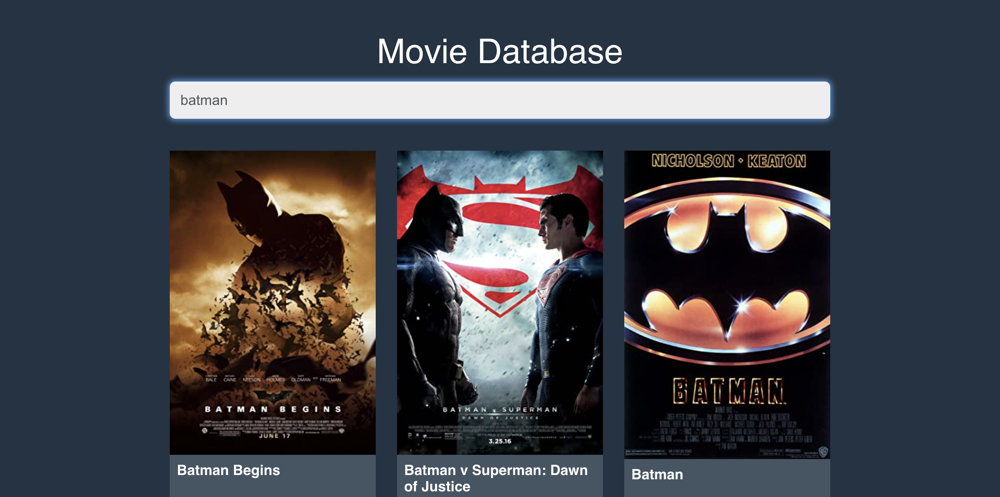
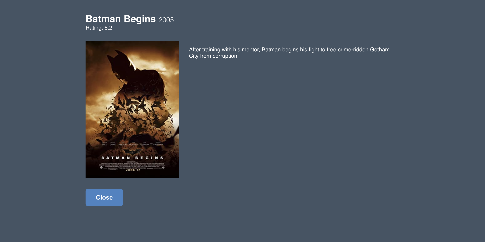

## Movies Database Website (ReactJs)

Learn how to code an interactive Movie Database app using ReactJS. We look into the implementations of using an API to get information about movies and display them on screen using react components. We also look into hooks such as the useState hook to create a functional state.

---

## Available Scripts

In the project directory, you can run:

### `yarn install`

yarn install is used to install all dependencies for a project. This is most commonly used when you have just checked out code for a project, or when another developer on the project has added a new dependency that you need to pick up. If you are used to using npm you might be expecting to use `--save` or `--save-dev`.

### `yarn start`

Runs the app in the development mode.\
Open [http://localhost:3000](http://localhost:3000) to view it in your browser.

The page will reload when you make changes.\
You may also see any lint errors in the console.

### `yarn test`

Launches the test runner in the interactive watch mode.\
See the section about [running tests](https://facebook.github.io/create-react-app/docs/running-tests) for more information.

### `yarn run build`

Builds the app for production to the `build` folder.\
It correctly bundles React in production mode and optimizes the build for the best performance.

The build is minified and the filenames include the hashes.\
Your app is ready to be deployed!

See the section about [deployment](https://facebook.github.io/create-react-app/docs/deployment) for more information.

------

### [Youtube Refefence](https://www.youtube.com/watch?v=ufodJVcpmps)

##### Movies DB API: [https://omdbapi.com/](https://omdbapi.com/)
